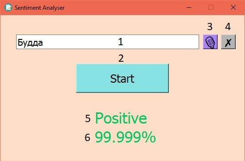

# Интерфейс программы
Данная программа содержит минимальный графический интерфейс для организации более удобного взаимодействия с пользователем.
Данный файл содержит подробное описание всех его элементов.

**1** - поле ввода текста (можно ввести текст вручную, с помощью файлового диалога или голосового ввода)

**2** - после нажатия кнопки "Start" начинается анализ введенного в поле ввода текста (вместо нее можно нажать клавишу "Enter")

**3** - данная кнопка предназначена для голосового ввода текста. После нажатия появляется всплывающее окно, после закрытия которого
можно начинать говорить. Если текст был удачно распознан, то он подставляется в поле ввода и его можно редактировать. Если же при
распознавании возникла ошибка, то появляется окно, сообщающее о ней.\
Возможны 4 вида ошибок: 
1. Текст не был распознан (`Unknown value error`)
2. Интернет-соединение потеряно (`Internet connection lost`). Данная процедура требует наличия подключения, так как при 
распознавании используется [решение от Google](https://cloud.google.com/speech/) посредством библиотеки 
[SpeechRecognition](https://pypi.python.org/pypi/SpeechRecognition), которая обращается к API.
3. Превышен лимит времени (`WaitTimeoutError`). Данная ошибка означает, что превышено время ожидания информации, поступаемой
с микрофона.
4. Микрофон отсутствует (`No microphone`) или был отсоединен во время распознавания (`Microphone was disconnected`). Также вы
можете столкнуться с такой ошибкой, если попытаетесь воспользоваться встроенным микрофоном (к примеру, в ноутбук), так как
данная библиотека работает только с внешним микрофоном.

**4** - кнопка для очистки поля ввода и результата \
**5** - тональность текста \
**6** - вероятность принадлежности текста к данной тональности  

[Лемматизация →](lemmatization.md)
