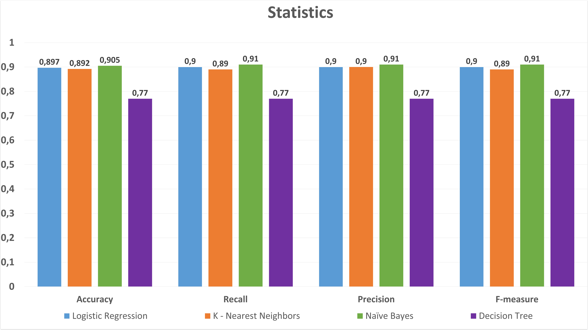
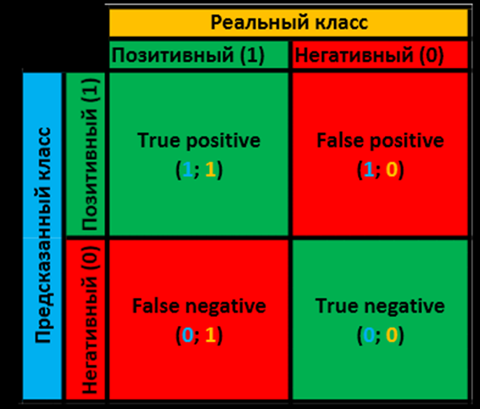

# Статистика
Данный файл содержит в себе сравнение результатов работы исследуемых методов классификации.

Были исследованы четыре метода классификации:\
**1.** **Logistic Regression.** Метод логистической регрессии основан на линейном дискрименанте Фишера. Иначе говоря, данный классификатор пытается максимально точно линейно разделить документы по бинарной шкале\
**2.** **K-Nearest Neighbors.** Классификатор, использующий метод К-ближайших соседей определяет для поступившего документа самую распространенную тональность среди К ближайших к нему соседей, основываясь на их признаках (весах по N-граммам).\
**3.** **Naive Bayes.** Данный метод классификации основывается на теореме Байеса о вероятностях. Наивный Байесовский классификатор рассчитывает вероятность принадлежности текста к какой либо тональности и выбирает наибольшую. Является "наивным",
так как предполагает, что признаки классифицируемого объекта не зависят друг от друга. Данный метод наиболее подходит для решения поставленной задачт.\
**4.** **Decision Tree.** Дерево решений строится на основе бинарного дерева и значимости признаков. Условия в дереве решений располагаются по значимости, сперва проверяются те признаки, которые больше всего уменьшают неопределенность.
Данный метод предназначен скорее для задач, которые имеют большое количество признаков, при этом данные признаки не являются числами, так как в случае чисел дерево решений не способно достаточно эффективно обучиться.

**Accuracy** = P/N, P – кол-во верно определенных документов, N – кол-во всех документов.\
**Precision** = TP / (TP+FP) - доля документов действительно принадлежащих данному классу относительно всех документов которые система отнесла к этому классу.\
**Recall** = TP / (TP+FN) -  это доля найденных классификатором документов принадлежащих классу относительно всех документов этого класса в тестовой выборке.\
**F** = 2 Precision * Recall / (Precision+Recall).\
\
\
[← Подсчет тональности](count_tonal.md)